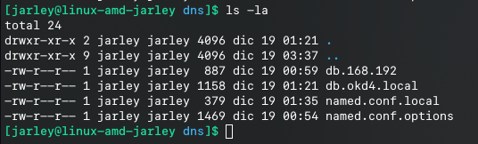
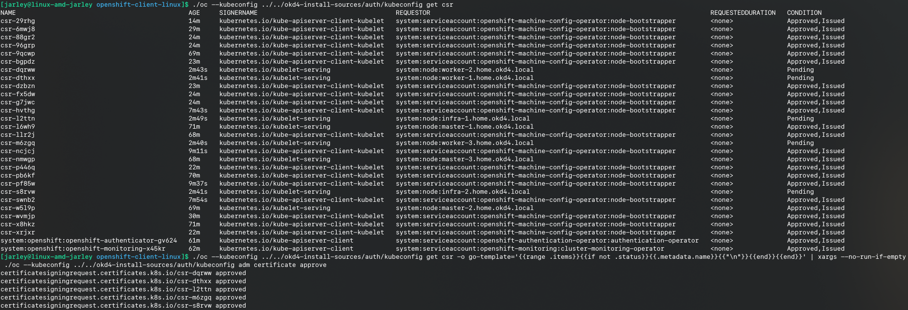
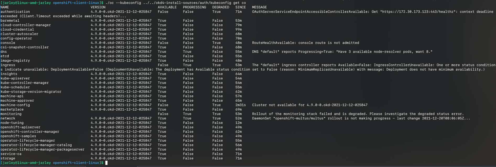

# okd4-up-local-cluster

Vamos a instalar un cluster local (bare metal aprovisionamiento UPI) utilizando VirtualBox para la administración y ejecución de nuestras máquinas virtuales, esto debido a que VirtualBox es el más accesible por la mayoría de los usuarios que deseen realizar esta instalación con el fin de aprender y conocer más sobre OKD/OCP 

Requisitos de Hardware:
===
Puedes usar más de un equipo para completar lo siguiente:

## Mímino:
Con estos recursos puedes completar la instalación, pero tendrás alertas de degradación de componentes/operadores
| Procesador/CPU | Memoria/RAM |
| :--- | :---: |
| i5/i7/Ryzen 5/Ryzen 7 de 4, 6 a más cores   | 60gb -> Bootstrap 6gb, 3 masters 8gb, 2 infras 6gb y 3 workers de 6gb |

## Eficiente:
| Procesador/CPU | Memoria/RAM |
| :--- | :---: |
| i7/i9/Ryzen 7/Ryzen 9 de 6, 10 a más cores   | 72gb -> Bootstrap 6gb, 3 masters 12gb, 2 infras 6gb y 3 workers de 6gb |


Sistema Operativo - Host
===
 Linux, en mi caso uso Arch Linux con DE kde, puedes usar el de tu preferencia.

| Software instalado |
| :--- |
| VirtualBox |
| LibVirt |
| ssh |
| sshpass |
| dig |
| cdrtools |
| curl |

Clonar el siguiente repositorio que contiene los OVAs base
https://github.com/jarley91/vbox-ovas.git

Configurar archivo .env
===
Configura los valores en el archivo .env dentro de la carpeta scripts, los datos de IP deben ser según tu subnet:


Servidor DNS
===
Para este servidor usé Debian, puedes elegir la distro Linux que prefieras y configurar tu servidor DNS:

Edita los archivos dentro de la carpeta dns según tu subnet:



Ejecuta el script para crear, configurar e iniciar tu servidor DNS:

```shell
cd scripts
sh create-dns-server.sh
```

Configura en tu host la IP de tu servidore DNS en el archivo /etc/resolv.conf y valida la resolución de nombres:

```conf
#/etc/resolv.conf
nameserver 192.168.X.X
```

```sh
dig master-1.${DOMAIN_NAME} +short
```


Servidor HTTP(Apache) y Balancer(HAproxy)
===
Para este servidor use Centos, si prefieres puedes implementar HTTP(Apache) y Balancer(HAproxy) en el servidor DNS, el fin de usar distintas distribuciones Linux es conocer más acerca de las mismas.

Configura el archivo haproxy.cfg en la carpeta haproxy según tus datos configurados en tu servidor DNS:


Ejecuta el script para crear, configurar e iniciar tu servidor HTTP(Apache) y Balancer(HAproxy):

```shell
sh create-http-haproxy-server.sh
```

Aprovisiona tus VMs
===
Para instalar un cluster OKD/OCP local debemos de crear las VMs para el bootstrap, masters, infras y workers 

Primero creamos los ISOs con la configuración necesaria para iniciar e instalar Fedora CoreOS, ejecuta el siguiente script: 

```shell
sh create-isos-okd-4-install.sh
```

Según los recursos de tu host edita y ejecuta el siguiente script para crear las VMs:

```shell
sh create-vms-okd-4-install.sh
```

Configurar y crear archivos de instalación OKD/OCP:
===

Revisa el último release del instalador y cliente en https://github.com/openshift/okd/releases y actualiza el valor OKD4_UTILS_VERSION en el archivo .env dentro de la carpeta scripts.

Crea tu ssh key:
ssh-keygen -t ed25519 -N '' -f ~/.ssh/okd4.key


Agrega tu ssh private key a ssh agent para tu usuario, esto permite autenticarte a los servidores bootstrap, masters, infras y workers sin una clave.

```shell
eval "$(ssh-agent -s)"
ssh-add ~/.ssh/okd4.key
```


Edita el archivo install-config.yaml dentro de la carpeta utils:


| Tag/Key | Valor |
| :--- | :--- |
| baseDomain | Tu nombre de dominio base, debe de coincidir con el valor DOMAIN_NAME en el archivo .env en la carpeta scripts |
| metadata/name | Tu nombre de dominio base, debe de coincidir con el valor CLUSTER_NAME en el archivo .env en la carpeta scripts |
| networking/machineNetwork/cidr | Según tu subnet |
| pullSecret | Puedes usar el que tiene por defecto, si deseas un cluster de prueba por 60 días habilitado  con lo que provee RedHat obtén tu pull secret desde https://console.redhat.com/openshift/install/pull-secret y reemplazas el valor |
| sshKey | Debes de usar el valor del archivo que contiene el public key que creaste con ssh-keygen (okd4.key.pub)  |

En este punto ya podemos iniciar la instalación:

Ejecuta el siguiente script, esto crea los manifiestos, configura que los masters no sean programables/schedulable, crea los ignitios y sube los archivos de instalación al servidor WEB:

```shell
sh create-manifests-ignitions.sh
```


Inicia tu servidor bootstrap, espera a que termine la instalación y cuando reinicia apagas el servidor para desmontar el archivo ISO, de lo contrario entrará en loop y volverá a instalar desde el archivo ISO:


Antes que se inicie nuevamente la instalación apaga el servidor y desmonta el archivo ISO:


Inicia nuevamente el servidor:


El servidor se reiniciará cuando termine de descargar lo necesario y ahora observarás dos entradas de inicio del kernel:


Ahora ya puedes iniciar sesión en el servidor con tu ssh private key que creaste:

```shell
ssh -i path-to/okd4.key core@bootstrap.home.okd4.local
```


Copia los binarios oc y kubectl al servidor bootstrap, esto servirá para validar como va nuestro cluster y aplicar ciertas configuraciones de ser necesario:

```shell
cd scripts/
source ./.env
scp -i /home/jarley/.ssh/okd4.key ${OKD4_WORK_DIR}/${PREFIX_NAME_CLUSTER_SERVER}-dir-install/downloads/openshift-client-linux/oc core@bootstrap.home.okd4.local:~/
oc
scp -i /home/jarley/.ssh/okd4.key ${OKD4_WORK_DIR}/${PREFIX_NAME_CLUSTER_SERVER}-dir-install/downloads/openshift-client-linux/kubectl core@bootstrap.home.okd4.local:~/
```


Configura los binarios oc y kubectl en tu servidor bootstrap:

```shell
sudo su
mv oc kubectl /usr/local/bin/
oc --kubeconfig /etc/kubernetes/kubeconfig get events
oc --kubeconfig /etc/kubernetes/kubeconfig get nodes
```


Inicia tus servidores masters, cuando termine la instalación y reinicia por primera vez aplica lo mismo que para el servidor bootstrap para desmontar el ISO:


Puedes verificar el estado del inicio de tu cluster con lo siguiente:

```shell
cd scripts/
source ./.env
openshift-install --dir ${OKD4_WORK_DIR}/${PREFIX_NAME_CLUSTER_SERVER}-dir-install/${PREFIX_NAME_CLUSTER_SERVER}-install-sources wait-for bootstrap-complete --log-level=info
```


No siempre tendrás el mismo mensaje, ya que depende de cuanto tome el inicio de cluster(bootstrap), si no logras tener la respuesta de la imagen, valida el estado de tus servidores masters y el estado de los pods apiserver:

Si ambos están bien, ya puedes seguir con los servidores infras y Workers, en este punto ya puedes apagar tu servidor bootstrap.


Inicia tus servidores infras(se agregar como worker, solo es tema de gusto tener el nombre de infra, ya que post instalación se configuran los roles), cuando termine la instalación y reinicia por primera vez aplica lo mismo que para el servidor bootstrap para desmontar el ISO:


Inicia tus servidores workers, cuando termine la instalación y reinicia por primera vez aplica lo mismo que para el servidor bootstrap para desmontar el ISO:


Desde tu host verifica los certificados pendientes para aprobar, debes de asegurarte que todos sean aprobados, por lo cual debes de ejecutar el comando de aprobación más de una vez:

```shell
cd scripts/
source ./.env
cd ${OKD4_WORK_DIR}/${PREFIX_NAME_CLUSTER_SERVER}-dir-install/downloads/openshift-client-linux/
./oc --kubeconfig ../../okd4-install-sources/auth/kubeconfig get csr
./oc --kubeconfig ../../okd4-install-sources/auth/kubeconfig get csr -o go-template='{{range .items}}{{if not .status}}{{.metadata.name}}{{"\n"}}{{end}}{{end}}' | xargs --no-run-if-empty ./oc --kubeconfig ../../okd4-install-sources/auth/kubeconfig adm certificate approve
```




Verifica y espera que los nodos y operadores estén listos, esto toma un tiempo dependiendo de cuan rápido descargue las imágenes que necesitan los infras/workers para crear los objetos necesarios:





Después de una espera algo larga, tenemos nuestro cluster local listo:


Post instalación
===
Iré publicando...

Referencia oficial de configuración e instalación: 
===
https://docs.okd.io/latest/installing/installing_bare_metal/installing-bare-metal.html
https://docs.okd.io/